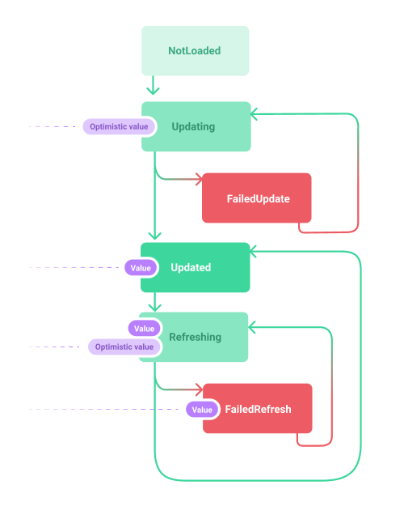

# Updated

Managing state of asynchronous updates as a simple dart representation.

## Quickstart

A simple usage example of the `Update` state and `update` method.

```dart
import 'package:updated/updated.dart';

Future<int> requestValue() async {
  await Future.delayed(const Duration(seconds: 1));
  return 42;
}

Future<void> main() async {
  var value = Update<int>();

  // ---
  // Value : 32
  // Is Loading...
  // Details : Updating<int>(id: 28313824297, startedAt: 2020-11-23 16:57:04.298751, optimisticValue: 32)
  // ---
  // Value : 42
  // Is not loading : Updated<int>(id: 28313824297, updatedAt: 2020-11-23 16:57:05.315, previousUpdate: 42)
  // Details : Updated<int>(id: 28313824297, updatedAt: 2020-11-23 16:57:05.315, previousUpdate: 42)
  await for (var item in update(
    updater: requestValue,
    getUpdate: () => value,
    optimisticValue: 32,
  )) {
    print('---');
    value = item;
    item.mapValue(
      value: (value, isOptimistic) => print('Value : $value'),
      orElse: () => print('No value'),
    );
    item.mapLoading(
      loading: () => print('Is Loading...'),
      notLoading: () => print('Is not loading : $value'),
    );
    print('Details : $item');
  }

  // ---
  // Value : 32
  // Is Loading...
  // Details : Refreshing<int>(id: 28313797308, startedAt: 2020-11-23 16:56:38.327266, previousUpdate: Updated<int>(id: 28313797307, updatedAt: 2020-11-23 16:56:38.322668, previousUpdate: 42), optimisticValue: 32)
  // ---
  // Value : 42
  // Is not loading : Updated<int>(id: 28313797308, updatedAt: 2020-11-23 16:56:39.334887, previousUpdate: 42)
  // Details : Updated<int>(id: 28313797308, updatedAt: 2020-11-23 16:56:39.334887, previousUpdate: 42)
  await for (var item in update(
    updater: requestValue,
    getUpdate: () => value,
    optimisticValue: 32,
  )) {
    print('---');
    value = item;
    item.mapValue(
      value: (value, isOptimistic) => print('Value : $value'),
      orElse: () => print('No value'),
    );
    item.mapLoading(
      loading: () => print('Is Loading...'),
      notLoading: () => print('Is not loading : $value'),
    );
    print('Details : $item');
  }
}
```

## Usage

An update represents the lifecycle of a `T` value that can be loaded asynchronously.



Its initial state is `NotLoaded`. During its first update, it goes through the `Updating` state then `Updated` or `FailedUpdate` states, whether it is a success or not. During the following updates, it goes through the `Refreshing` state then `Updated` or `FailedRefresh` states, whether it is a success or not.

#### Initialization

To create an updated property, create an `Update<T>`.

```dart
final property = Update<int>();
```

#### Updating

The easiest way to update your `Update<T>` instance is by using the `update` function that returns a `Stream` with the sequence of updates.

```dart
var value = Update<int>();

final updateStream =  update(
    // The actual async operation
    updater: () async {
      // your async calls
    },
    // Make sure to always return the current value. This makes cancellation possible.
    getUpdate: () => value, 
    // This value will be available durint loading states
    optimisticValue: 32, 
    // To change the behaviour when an update is triggered but the previous isn't finished yet. 
    // If a previous update is cancelled then its stream is closed an no more events are emitted.
    override: UpdateOverride.cancelPrevious,
  ));
```

> If an `optimisticValue` is given, then its value is returned by the `Update.mapValue` method. This may be useful to display the result to the user beforehand if we're able to anticipate it (for example, by liking a tweet on twitter, we can fill the heart before receiving the result of the request that validates it).

> If a new update is triggered with the `cancelPrevious` option, then the previous update stream won't emit its final updates.

#### Mapping result

You can map the current state of an `Update<T>` instance with the `map`, `mapValue`, `mapLoading`, `mapError` methods.

```dart
@override
Widget build(BuildContext context)
 return state.products.mapValue(
      value: (value, isOptimistic) => ProductList(products: value),
      orElse: () => EmptyView(),
    );
}
```

```dart
@override
Widget build(BuildContext context)
 return state.products.mapError(
      error: (error, stackTrace) => ErrorView(error: error),
      orElse: () => ResulView(),
    );
}
```

```dart
@override
Widget build(BuildContext context)
 return state.products.mapLoading(
      loading: (error, stackTrace) => LoadingView(),
      notLoading: () => ResulView(),
    );
}
```


```dart
@override
Widget build(BuildContext context)
 return state.products.map(
      updated: (state) => UpdatedView(),
      failedRefresh: (state) => FailedView(),
      refreshing: (state) => LoadingView(),
      updating: (state) => LoadingView(),
      failedUpdate: (state) => FailedView(),
      notLoaded: (state) => NotLoadedView(),
    );
}
```

#### UpdateNotifier

An `UpdateNotifier<T>` is a mutable store for an `Update<T>` instance.

The [update] is updated by calling [execute].

```dart
final notifier = UpdateNotifier<int>();

final currentUpdate = notifier.update;

notifier.updateChanged.listen((update) {
    // ...
});

notifier.execute(
    // The actual async operation
    updater: () async {
      // your async calls
    },
    // This value will be available durint loading states
    optimisticValue: 32, 
    // To change the behaviour when an update is triggered but the previous isn't finished yet. 
    // If a previous update is cancelled then its stream is closed an no more events are emitted.
    override: UpdateOverride.cancelPrevious,
  ));
```

> If you're using patterns base on immutable data (like redux, MVU), using `update` function directly may be more appropriate.